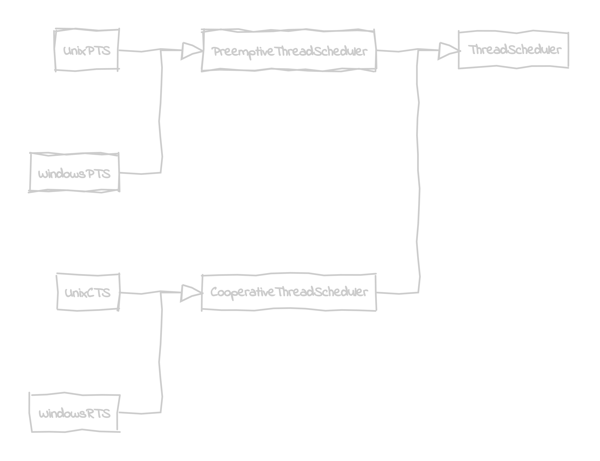
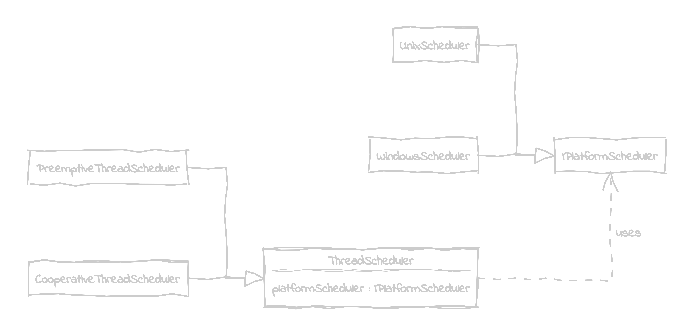

# 🌉 Bridge

Connecting different components together through a abstractions.

Bridge is a mechanism that decouples an interface (hiearchy) from an implemenatation (hiearchy). (JS has duck typing, so definitions of interfaces are not stricly necessary).

### Motivation
Bridge prevents a 'Cartesian product' complexity explosion. It allows to develop components in isolation from each other. The contract is only defined through an interface and can be later fulfilled by any implementation.

Bridge pattern avoids the entity explosion.

**Example**
- Base class ThreadScheduler 
- Can be rpeemptive or cooperative
- Can run on Windows or Unix
- End up with a 2x2 scenario: Preemptive/Cooperative x Windows/Unix = 4 possible combinations. 

Before Bridge issue:

Before Bridge after:

Drawbacks: Number of methods is equal number of renderes.
