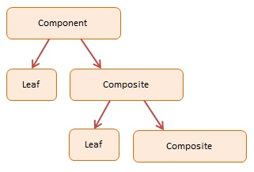

# 💥 Composition
A mechanism for treating individual (scalar) objects and compositions of objects in a uniform manner.

Objects use other objects fields/methods through inheritance and composition.

Composition lets us make compound objects 
- e.g. mathematical expression compoesed of simple expressions,
- A shape group made of several different shapes

Composite design pattern is used to treat both single (scalar) and composite objects uniformly.

## Composite Diagram
The Composite Design Pattern is a structual design pattern that is used to represent data and compose objects in the system into a tree-like structure.

The objects participating in this pattern are:
- **Component** -- In example code: Node declares the interface for objects in the composition
- **Leaf** -- In example code: Node represents leaf objects in the composition. A leaf has no children.
- **Composite** -- In example code: Node represents branches (or subtrees) in the composition maintains a collection of child components.

## Sumamary
Objects can use other objects via inheritance/composition.

Some composed and singular objects need similar/identical behaviors.

Composite design pattern lets us treat both types of objects uniformly.

Javascrupt supports iteration with Symbol.iterator.

A single object can make itself iterable by yielding this. 